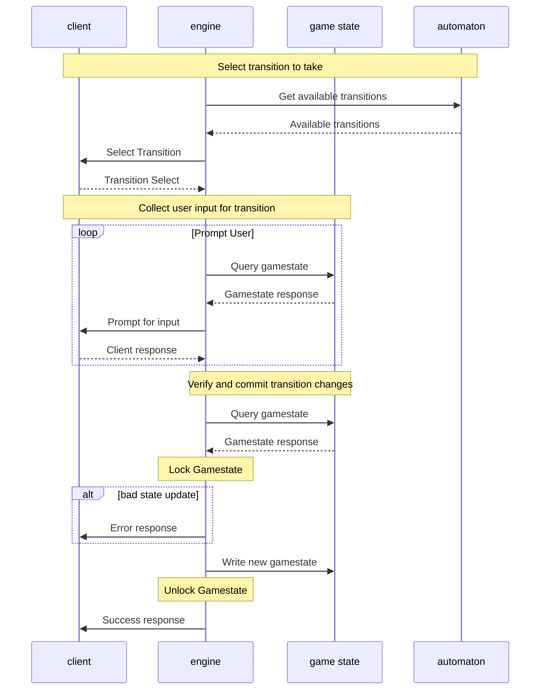
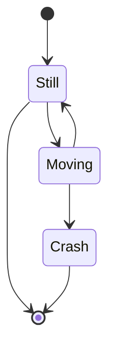

# Plank Design doc

## Design Overview
The project can be divided into a few main components. In general there are two primary portions. The game engine and support libraries that are part of the Plank project itself and the game specific code that contains all ofthe specific game logic for the game being played. The purpose of the engine and support libraries is to consolidate as much of the repetitive code that would be required to implement the games to simplify the game writing process.

The Plank core is made up of the code that is not meant to be extended by the game writer. It contains the basic logic for managing players, lobbies, etc as well as all of the network connections and synchronization code.

Above the plank core are the plank libraries which provide interfaces between the core and the game code, but are meant to be extended for the specific game being implemented. For instance the prompt library contains primitives for communicating with the players, but if you want a more custom interface for communication it will be built on one of the base prompt functions. Additionally the components library contains basic components for implementing the game state. Things like cards, dice, etc.

The Game specific code is implemented by buildling the game speicific automaton an then supplying the game logic code as the transitions. In addition the game state that will be manipulated by the transitions is built up using components from the components library.

## Player interaction
The interaction between a player and the game engine when they are in an active state and trying to commit the result of a transition.

## Automatons
The game automaton is divided into a few different types of nodes. When a player is at a node with one or more transitions they select a transition to activate and provide the input data through the prompt API. That data is run through the transition code and assuming that the transition prouces a valid new game state (as defined by the transition's own verification code) then the update is comitted and the user is moved to the next node in the automaton. There are also oracle nodes that instead of prompting the user on which transition to fire simply query the game state to determine the next node the user should be moved to. The last mechanism for traversing the automaton is a dependant transition where a player in some state will transition as a side effect of another transition firing. In general this last form is used when other players are waiting for some "active" player to make some move before moving on with the game.

### Example Automatons:

